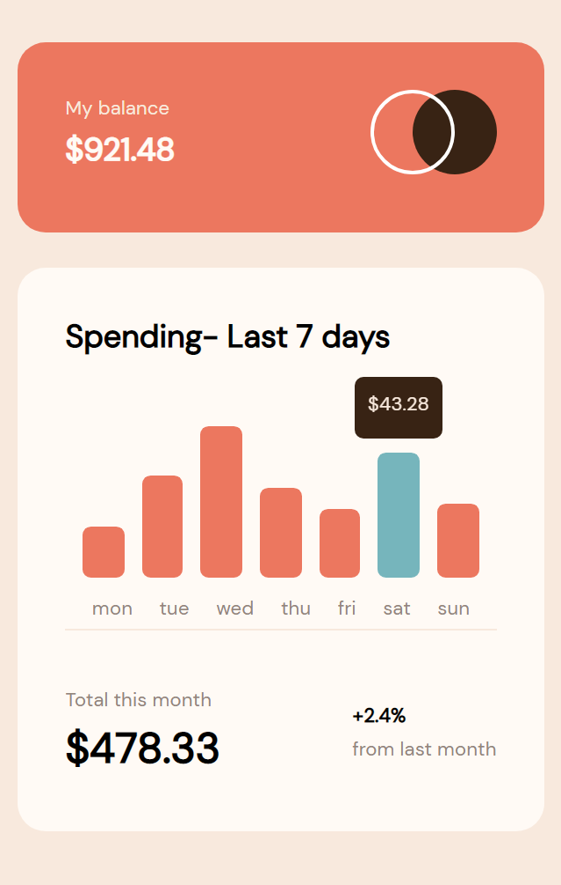
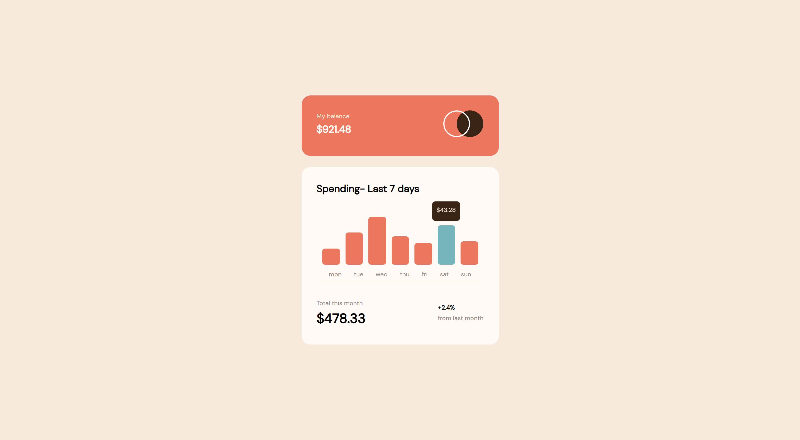

# Frontend Mentor - Expenses chart component solution

This is a solution to the [Expenses chart component challenge on Frontend Mentor](https://www.frontendmentor.io/challenges/expenses-chart-component-e7yJBUdjwt). Frontend Mentor challenges help you improve your coding skills by building realistic projects.

## Table of contents

- [Overview](#overview)
  - [The challenge](#the-challenge)
  - [Screenshot](#screenshots)
  - [Links](#links)
- [My process](#my-process)
  - [Built with](#built-with)
  - [What I learned](#what-i-learned)
  - [Continued development](#continued-development)
  - [Useful resources](#useful-resources)
- [Author](#author)

## Overview

### The challenge

Users should be able to:

- View the bar chart and hover over the individual bars to see the correct amounts for each day
- See the current day’s bar highlighted in a different colour to the other bars
- View the optimal layout for the content depending on their device’s screen size
- See hover states for all interactive elements on the page
- **Bonus**: Use the JSON data file provided to dynamically size the bars on the chart

### Screenshots

#### For small screens



#### For large screens



### Links

- Solution URL: [Add solution URL here](https://your-solution-url.com)
- Live Site URL: [Add live site URL here](https://your-live-site-url.com)

## My process

### Built with

- Semantic HTML5 markup
- SCSS custom properties
- Flexbox
- CSS Grid
- Mobile-first workflow

### What I learned

This challenge actually made me relearn some css properties that I had forgotten. Good example is the CSS transform property. As I chose not to use
any libraries or frameworks, I had to get creative. This made making the bar chart particularly challenging.

#### My favourite css

I thought about using Chart.js for the graph but I changed my mind. The transform property helped me to get the height of the bars from the bottom rather than the top (which was what happened initially)

```css
    .bar{
        position: relative;
        background-color: $primary-color;
        height: 0;
        width: (90% / 7);
        border-radius: .3rem;
        position: relative;
        cursor: pointer;
        transition: height .2s ease-in;

        &.today{
            background-color: $primary-color-alt;
        }

        &:hover .data-point{
            opacity: 1;
        }

        .data-point{
            position: absolute;
            width: 50px;
            background-color: $secondary-color;
            height: 35px;
            top: 110%;
            right: 50%;
            border-radius: 5px;
            display: grid;
            place-items: center;
            transition: all .1s ease-in;
            opacity: 0;
            transform: rotateX(180deg) translateX(50%);

            p{
                font-size: .7rem;
                color: $secondary-color-lighter;
            }
        }

    }
}
```

#### My favourite Javascript

This is also my favourite. Getting the local `data.json` file and populating the graph with it.

```js
fetch("./data.json")
  .then((res) => res.json())
  .then((data) => populateGraph(data))
  .catch((err) => console.log(err));

function populateGraph(data) {
  const yAxisMax = 150;

  let date = new Date();

  for (let i = 0; i < 7; i++) {
    bar[i].style.height = (data[i].amount * yAxisMax) / 100 + "%";
    day[i].innerHTML = data[i].day;
    amount[i].innerHTML = data[i].amount;

    if (i + 1 == date.getDay()) {
      bar[i].classList.add("today");
    }
  }
}
```

### Continued development

I'm still a beginner at React. It was tempting to use React for this but I felt I barely knew anything to this with React but I'll definitely use React in the next one.

### Useful resources

- Javascript charts - [charts.js](https://www.chartsjs.org)

I did not use this in the challenge but I used in some projects of mine and its absolutely amazing and easy to use

## Author

- Website - [Benson Osei-Mensah](https://www.your-site.com)
- Frontend Mentor - [@bensonOSei](https://www.frontendmentor.io/profile/yourusername)
- Twitter - [@webdevbenson](https://www.twitter.com/webdevbenson)
